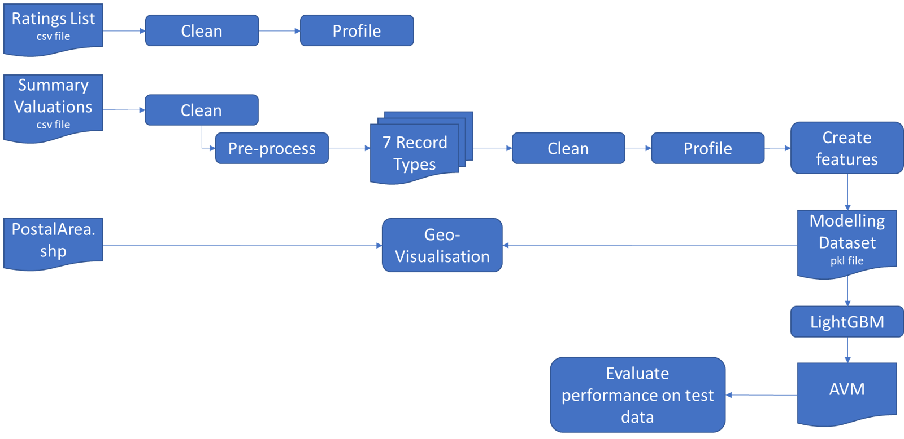

# voa-data-project

This project illustrates building a machine learning model to perform a regression task.  Specifically an Automated Valuation Model (AVM) is created to predict the 'rateable value' of commercial properties in England and Wales.  There are currently three Jupyter notebooks covering:

1. Initial data processing and exploratory analysis
2. Data visualisation
3. Creating a machine learning model

The main packages used are: pandas, geopandas, LightGBM and scikit-learn.

## Data

The data source for this analysis is a list of the rateable values of 2 million commercial properties in England and Wales.  This data is maintained and provide by the Valuation Office Agency ("VOA").  The VOA is an executive agency of the UK government responsible for providing the valuations and property advice needed to support taxation and benefits.  The data can be downloaded [here](https://voaratinglists.blob.core.windows.net/html/rlidata.htm).  Please be sure to review the terms and conditions on that page before accessing the contents of this repository.

In addition, a shapefile of postal areas for England and Wales was obtained from the University of Edinburgh [DataShare](https://datashare.ed.ac.uk/handle/10283/2405).  Citation:  Crone, James. (2017). GB Postcode Areas, [Dataset]. University of Edinburgh. https://doi.org/10.7488/ds/1755

## Overview of Modelling Process

The following chart gives an overview of the modelling process.

